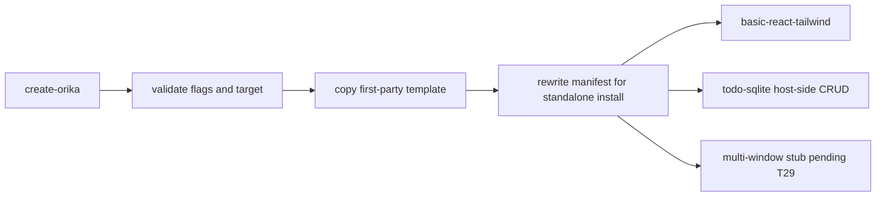

# Rewrite templates and scaffold for v4-native shape

## What we set out to do

Issue #1098 asked the first-run path to stop teaching the pre-v4 surface. The intended shape was a rewritten `basic-react-tailwind` template, a new `todo-sqlite` bridge-crossing app, an optional `multi-window` template gated on the cluster verdict, and a `create-orika` scaffold CLI that copies templates, accepts storage/workflow/cluster flags, and pins the Effect beta tuple.

## What actually ended up working

The branch worked after narrowing the shipped promise. The scaffold CLI now validates selected templates, rejects unsafe project names and non-empty output directories, rewrites `workspace:*` first-party dependencies, pins Effect versions, and tests every selectable template and dependency matrix. `basic-react-tailwind` was rewritten against the v4-native contract/spine shape. `todo-sqlite` became a host-side CRUD template using `Model.Class`, `SqlModel.makeRepository`, and `Reactivity.mutation`; it did not become the full renderer-side sqlite-wasm cache plus atom-react live query example described in the issue. `multi-window` remains an explicit stub pending the T29 cluster verdict.

## What surfaced in review

Three review rounds were run. Round 1 found scaffold-boundary blockers: valued flag operands could become the project name, existing directories could be overwritten, generated manifests leaked `workspace:*`, optional flags promised more wiring than they provided, and template READMEs lagged the new behavior. Round 2 added runtime template validation, path-segment copy filtering, localized template copy, and broader CLI/scaffold tests. Round 3 found no new CI blockers, but kept two scope concerns unresolved: `todo-sqlite` still does not satisfy the issue's full renderer-side storage/live invalidation promise, and `multi-window` stays gated by the cluster go/no-go decision.

## First-principles postmortem

The invariant was that a scaffold is a consumer contract, not a repo-local example. The repo can pass while a generated project fails to install, overwrites user files, or teaches an unsupported dependency shape. The useful correction was to move checks to the scaffold boundary: validate user input before copying, reject ambiguous targets, normalize manifests before writing, and test the generated output rather than only the source templates.

## Game-theory postmortem

The local incentive was to make the templates look complete by exposing flags and examples before their dependent primitives had stable verdicts. That creates a bad equilibrium: every later engineer copies aspirational template code and assumes the framework supports it. The better mechanism is explicit narrowing. Ship the concrete scaffold behavior that is proven, label stubs as stubs, and leave unresolved review threads visible when a comment points at scope the branch did not actually deliver.

## Non-obvious lesson

Template PRs need consumer-boundary tests and promise-boundary review. A green monorepo gate proves the checked-in files typecheck; it does not prove `bun create effect-desktop` produces an installable, non-destructive, honest starting point for a user outside the repo.

## Reproducible pattern (if any)

For scaffold work, test the generated project boundary: selected template, optional dependency matrix, target safety, and absence of `workspace:*`.
Keep CLI help and README wording at or below what the generated source actually wires.
When a template depends on an unfinished track, ship it as a named stub or split it into a later issue.

## AGENTS.md amendment candidate (if any)

Scaffold and template changes should include at least one consumer-boundary verification that inspects generated output, not only source-template tests. Why: templates are copied contracts, and repo-local checks can miss installability and promise mismatches.

This is a proposal. Review and edit AGENTS.md yourself if you want to adopt it — `/learn` never auto-edits AGENTS.md.
