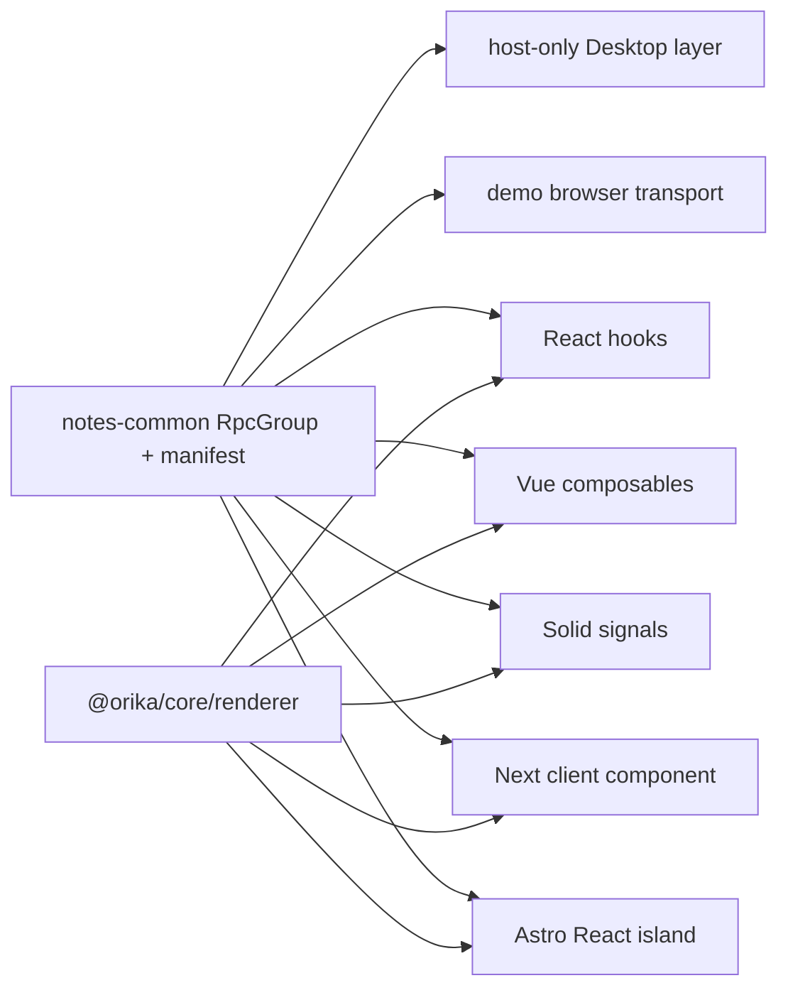

# Add cross-framework Notes example applications

## What we set out to do

Add runnable Apple Notes-style examples for React, Vue, Solid, Next, and Astro that all consume one shared Effect `RpcGroup` contract and desktop app manifest. The examples had to prove framework-native adapter surfaces, avoid Astro hooks in `.astro` files, and verify the UI through a browser/desktop loop instead of leaving only snippets in docs.

## What actually ended up working

The shared `notes-common` package became the useful center: it owns the renderer-safe schemas, `NotesRpcs`, manifest, initial state, demo browser transport, and host-only desktop layer split into `host.ts`. React, Vue, Solid, Next, and Astro then import the same manifest and present the same notes workflow through hooks, composables, signals, a Next client component, and an Astro React island.

The examples also exposed a real framework boundary bug. Importing the normal core barrel from renderer packages pulled host-only Bun/runtime modules into browser builds, so the framework now has `@orika/core/renderer` and shared RPC group metadata. That keeps renderer adapters on descriptor/client types while desktop startup code stays in the host path.

## What surfaced in review

The `/code-review` pass found no blocking or actionable findings. The useful review pressure happened during verification instead: CI caught that Astro's generated `.astro` type directory is created before `format:check`, and the API gate caught that the renderer-safe core entrypoint intentionally changed the public package surface. Both failures were branch-owned and fixed before merge by ignoring generated Astro output for Prettier and updating the core API snapshot.

## First-principles postmortem

The invariant was that examples should prove the same app boundary real users will copy. A demo can have fake persistence, but it cannot fake the contract shape or import graph. The important assumption that changed was that the core package barrel could be renderer-safe. It was not: a renderer-safe SDK surface needs an explicit renderer subpath, because host authority and renderer metadata are different things.

## Game-theory postmortem

The bad local incentive was to make each framework example compile by importing whatever public barrel had the needed type. That makes the shortest path cheap for the author and expensive for every app developer who later hits Bun-only modules in a browser build. The mechanism that improved alignment was forcing all examples to share one `RpcGroup` and run in real browser dev servers. The examples became adversarial tests for the SDK boundary instead of decorative samples.

## Non-obvious lesson

Cross-framework examples are not just documentation; they are import-boundary tests. If five frameworks cannot consume the same contract through their native primitives without pulling host code into the renderer, the SDK surface is still complected.

## Reproducible pattern (if any)

Build one shared app contract first.
Keep host-only layers in a separate module from renderer-safe contracts.
Give renderer adapters a renderer-only core subpath.
Run examples in real framework dev servers before trusting typechecks.

## AGENTS.md amendment candidate (if any)

When adding framework examples, verify the examples through real framework dev servers before merge. Why: examples reveal renderer/host import leakage that unit tests and snippets miss.

This is a proposal. Review and edit AGENTS.md yourself if you want to adopt it - `/learn` never auto-edits AGENTS.md.
