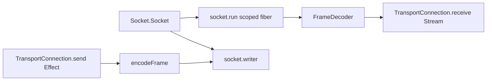

# Issue #1161: Shape Framed Transport as Effect Socket Stream

## Current state

`packages/core/src/runtime/transport.ts` still has a Promise-shaped framed transport:

- `FramedTransport.send(...)` writes framed bytes through an arbitrary callback.
- `FramedTransport.recv()` pulls decoded frames through an async iterator.
- `FramedTransport.close()` manually races pending receives against a closed promise.
- `createBunStdioTransport()` binds directly to `Bun.stdin` and `Bun.stdout`.

The frame codec is useful and should stay small. The runtime lifecycle around the codec is the
problem: socket open, write, read, close, interruption, and scope ownership already belong to Effect
`Socket`, `Stream`, and `Scope`.

## Architecture

Keep length-prefixed frame encoding/decoding as core transport policy, but delete the Promise
transport adapter. Runtime connections should be Effect values:

```ts
export interface TransportConnection {
  readonly send: (payload: Uint8Array) => Effect.Effect<void, TransportError>
  readonly receive: Stream.Stream<Uint8Array, TransportError>
  readonly close: () => Effect.Effect<void, TransportError>
}
```

Add `makeFramedSocketConnection(socket, options, operation)` as the binding point between the codec
and Effect socket primitives:

- acquire `socket.writer` in the caller's `Scope`;
- fork `socket.run(...)` in the caller's `Scope`;
- decode incoming chunks with the existing frame decoder;
- expose decoded frames through an Effect `Stream`;
- map frame, read, write, close, and closed states into typed `TransportError` values.

`Transport.connect({ target: "stdio" })` should require `Socket.Socket | Scope.Scope`, then use the
`layerStdioSocket` adapter at the runtime entry point. `packages/core/src/runtime/main.ts` should
provide that layer at the process edge instead of constructing a Bun-specific framed transport
inside module scope.



## Files

- `packages/core/src/runtime/transport.ts`
  - Delete `FramedTransport`, `createFramedTransport`, `createBunStdioTransport`, and
    `makeConnection`.
  - Add `FrameCodecOptions` and `makeFramedSocketConnection`.
  - Keep `encodeFrame`, `FrameDecoder`, `frame`, `unframe`, `unframeStream`, and in-memory
    transport helpers.
- `packages/core/src/runtime/main.ts`
  - Build stdio transport through `makeTransport().connect(...)` inside `Effect.scoped`.
  - Provide `layerStdioSocket` only at the Bun entry edge.
- `packages/core/src/runtime/host-client.ts`
  - Consume `TransportConnection.receive` as a `Stream` and `send` as an `Effect`.
- `packages/core/src/runtime/transport.test.ts`
  - Replace Promise transport tests with socket-backed tests for send, receive, close, read
    failure, and service-provided `Socket.Socket`.
- `packages/core/src/runtime/host-client.test.ts`
  - Replace Promise fixtures with `TransportConnection` fixtures.
- `packages/core/src/index.test.ts`
  - Assert the runtime transport subpath exposes `makeFramedSocketConnection` and no longer exposes
    `createFramedTransport`.
- `engineering/roadmap/layer-first-issue-order.md`
  - Mark #1161 implemented after validation.
- `engineering/learnings/2026-05-12-effect-socket-framed-transport.md`
  - Capture the rule that frame policy can be local, but runtime transport lifecycle should stay
    Effect-owned.

## Tests

Focused:

- `bun test packages/core/src/runtime/transport.test.ts packages/core/src/runtime/host-client.test.ts packages/core/src/runtime/main.test.ts packages/core/src/runtime/stdio-socket.test.ts packages/core/src/index.test.ts`
- `bun run --filter @effect-desktop/core typecheck`
- `bun run desktop check --api --write`
- `bun run desktop check --api`

Broad before push:

- `bun run check`
- `bun run typecheck`
- `bun run lint`
- `bun run lint:types`
- `bun run format:check`
- `git diff --check`
- `bun test`
- `bun run build`
- `cargo fmt --check`
- `cargo check --workspace`
- `cargo test --workspace`
- `cargo clippy --workspace --all-targets -- -D warnings`

## Thin wrappers / follow-ups

Remove now:

- The Promise `FramedTransport` adapter and Bun-specific `createBunStdioTransport` wrapper.
- Host-client Promise bridging around transport send/receive.

Keep:

- `makeFramedSocketConnection`, because it owns desktop frame codec policy and typed error mapping
  while delegating lifecycle to Effect socket and scope primitives.

Tracked follow-up:

- #1209 already owns the same before/after for `packages/vite/src/stdio-bridge.ts`, which still
  has a callback-shaped stdio bridge over manual frame handlers. Do not duplicate that issue; keep
  this slice focused on core runtime transport.
