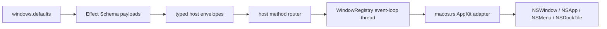

# Issue 103 Architect

## Problem

macOS-only polish is currently described in the public Effect contracts and spec, but the host either ignores the configured window defaults or returns unsupported host adapters for the Dock/Menu paths.

## Game board

- Players: macOS app users, app authors using `@orika/native`, host maintainers, reviewers, CI.
- Incentives: app authors want platform polish without app-local AppKit calls; maintainers want one host-owned OS boundary; reviewers need typed evidence instead of visual claims.
- Information asymmetries: TypeScript callers can see Effect contracts, but only the Rust host knows whether AppKit applied a visual effect, Dock badge, or menu.
- Bad equilibrium: every app hand-rolls AppKit integration or the framework advertises Appendix K support while silently no-oping.
- Desired equilibrium: macOS-specific behavior lives behind one host-owned platform module, and unsupported/non-macOS paths return typed `Unsupported` values.

## Constraints

- `engineering/SPEC.md` §11 and Appendix K require `Window.setVibrancy`, Dock badge/text/menu/attention, and application/window menus on macOS.
- Host event-loop work must stay on the OS event-loop thread.
- Effect-owned TypeScript paths must use `Effect`, `Layer`, `Schema`, typed errors, and no thrown/silent failures.
- Rust host boundaries return `HostProtocolError`.
- Existing `Window.create` wire payload only contains title/width/height; `windows.defaults` are not yet represented in host protocol.
- Local development is on macOS; Blacksmith CI is the cross-platform proof gate.

## Grounding findings

- `crates/host/src/window.rs` creates Tao windows and already applies platform polish after build.
- `crates/host/src/windows.rs` established the repo pattern for a narrow platform module with no-op non-platform implementations and typed `HostProtocolError` returns.
- `packages/native/src/window.ts`, `dock.ts`, and `menu.ts` already expose Effect services and Schema contracts; many host-backed methods currently return typed unsupported/unimplemented errors.
- `crates/host-protocol/src/lib.rs` and `packages/bridge/src/window.ts` deny unknown window create payload fields, so configured vibrancy/traffic-light defaults require explicit schema additions before crossing the boundary.
- `engineering/SPEC.md` §4206/§4251-4253 names `windows.defaults.titleBarStyle`, `vibrancy`, and `trafficLights`; Appendix K names the macOS-only support matrix.

## Core trade-off

I am trading full visual feature breadth for a narrow host-owned platform adapter that makes advertised macOS behavior explicit, typed, and testable.

## Architecture

Add `crates/host/src/macos.rs` as the macOS peer of `windows.rs`. It owns AppKit calls for window vibrancy/traffic-light placement, Dock badge/menu/attention, and menu installation. The host window create path accepts a typed `MacosWindowPolish` derived from explicit create payload/default fields and calls the macOS module after Tao window creation, while later `Window.setVibrancy`, `Dock.*`, and `Menu.*` methods route through host method adapters instead of remaining unsupported.

Keep the TypeScript side as Effect orchestration only: schemas validate inputs, bridge clients return `Effect.Effect<_, HostProtocolError, never>`, and unsupported non-macOS methods fail through typed `Unsupported` errors rather than throws or boolean no-ops. Platform capability queries stay pure data decisions; OS work stays in Rust on the event-loop thread.

## Modules

1. **Window payload defaults** - Responsibility: carry title-bar style, vibrancy, and traffic-light offsets across the existing Window create contract. Interface: `WindowCreatePayload { title?, width?, height?, titleBarStyle?, vibrancy?, trafficLights? }`. Hides: serialization parity between TS and Rust. Dependency: pure-core/schema. State: none. Errors: `InvalidArgument` on malformed values. Incentive effect: callers cannot smuggle platform settings through ad-hoc fields. Tests: Rust/TS unknown-field and valid-payload round trips.
2. **MacosWindowPolish** - Responsibility: validate and normalize macOS window polish. Interface: `MacosWindowPolish::from_window_request(&WindowCreateRequest) -> Result<Option<Self>, HostProtocolError>`. Hides: allowed vibrancy names and title-bar applicability. Dependency: in-process. State: none. Errors: `InvalidArgument`; non-macOS no-op only behind cfg. Incentive effect: platform options are one typed value, not scattered string checks. Tests: material mapping, traffic-light validation, null/absent defaults.
3. **macos.rs platform adapter** - Responsibility: apply AppKit calls. Interface: `apply_window_polish(&Window, Option<&MacosWindowPolish>)`, `set_vibrancy`, `set_dock_badge_text`, `request_attention`, `set_application_menu`, `set_window_menu`. Hides: unsafe AppKit selectors and Tao `ns_window` access. Dependency: true-external. State: AppKit-owned. Errors: `HostProtocolError`; unsupported on non-macOS. Incentive effect: unsafe OS calls have one review target. Tests: compile on macOS, pure mapping tests everywhere, Blacksmith macOS host tests.
4. **Effect native adapters** - Responsibility: keep `Window`, `Dock`, and `Menu` clients typed and permission-capable. Interface: existing `WindowClientApi`, `DockClientApi`, `MenuClientApi`. Hides: host envelope shape. Dependency: ports-and-adapters. State: ResourceRegistry-owned handles only. Errors: `HostProtocolError` in the Effect error channel. Incentive effect: callers compose Effects and cannot catch/ignore thrown platform failures. Tests: bridge request shape, typed unsupported failures, service delegation.

## Principle fit

- **First principles:** the invariant is "advertised macOS support is either implemented or typed unsupported"; the design starts from that boundary, not AppKit mechanics.
- **Deep modules / information hiding:** unsafe AppKit calls live in `macos.rs`; callers only see typed protocol data.
- **Composition / extensibility:** this extends the existing Effect service and host-router seams without adding a generic platform manager.
- **Effects/errors:** TypeScript effectful paths stay in `Effect`; Rust returns `HostProtocolError`; no thrown or swallowed platform failures.
- **State/lifecycle:** window polish is applied on window creation and later commands route through the existing event-loop command path.

## Quality Attributes

- Performance: O(1) per command; no background polling.
- Reliability: unsupported platform behavior is typed; AppKit failures return or log only when the spec makes the behavior polish rather than an invariant.
- Security: no new filesystem/network authority; menu command execution remains governed by existing command/permission services.
- Observability: host logs failed optional polish and returns operation-specific errors for required commands.
- Testability: pure mappings are unit-tested; bridge schemas are tested in Bun; platform compile/runtime behavior is proven on macOS CI.
- Migration: additive protocol fields only; existing create payloads remain valid.

## Non-goals

- Linux polish (#104).
- Cross-platform verification matrix wiring (#105).
- Full menu command activation lifecycle beyond the existing `Menu.bindCommand` contract.
- Notarization or signing behavior.

## Handoff

Architecture proposed. Continue to `/review`.
