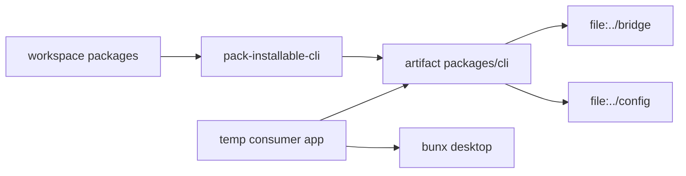

# Issue 769 Architecture

Decision: keep the workspace manifest linked with `workspace:*`, but add an explicit installable-artifact packer that rewrites the copied CLI manifest to sibling `file:` specs and proves that artifact from a temp consumer project.

The current truth is that `@orika/cli` is the public command package but its manifest points at `@orika/bridge` and `@orika/config` with `workspace:*`. Outside the monorepo, Bun has no workspace that contains those packages, so installation fails before the `desktop` bin exists. The invariant is that a consumer app must be able to depend on the CLI package artifact and run the bin without inheriting the framework repo's workspace.

The trade-off is adding a small artifact boundary instead of changing the checked-in workspace manifest. A direct manifest change to `file:../bridge` and `file:../config` makes Bun 1.3.13 treat `bun install --frozen-lockfile` as dirty on every run, so the workspace source of truth must stay workspace-native and the consumer artifact must own the rewrite.

Modules:

| Module                 | Responsibility                                                     | Interface                       | Hides                               |
| ---------------------- | ------------------------------------------------------------------ | ------------------------------- | ----------------------------------- |
| Workspace CLI manifest | Keep monorepo development linked and frozen-lockfile stable        | `workspace:*` dependencies      | In-repo package graph               |
| Installable CLI packer | Copy the CLI dependency set and rewrite only the artifact manifest | `pack-installable-cli <output>` | Bun workspace/file dependency split |
| Consumer install smoke | Prove a temp app can install and execute the CLI bin               | Bun test spawning `bun install` | Package-manager resolution behavior |
