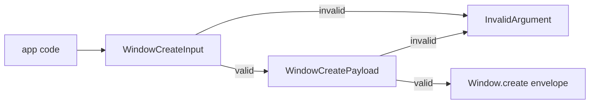

## Problem

`Window.create` chrome fields are typed too loosely, so malformed UI state can cross into the host as a normal request.

## Decision

Deepen the existing create schemas instead of adding a new validation layer.

## Core Trade-Off

I am trading a small literal union duplicated at the SDK and bridge boundary for explicit rejection before host I/O.

## Architecture

`WindowCreateInput` remains the SDK boundary. It should accept only:

- a non-empty supplied title;
- positive finite width and height;
- known title bar styles;
- known macOS vibrancy material names accepted by the host;
- finite traffic-light coordinates greater than or equal to zero.

`WindowCreatePayload` in `@orika/bridge` mirrors the chrome contract because it is the lower request-construction boundary. This avoids a split where SDK callers are protected but direct bridge callers can still emit impossible host envelopes.

## Modules

- `packages/native/src/window.ts`: narrows title, vibrancy, and traffic-light coordinate schemas.
- `packages/bridge/src/window.ts`: mirrors the narrowed host payload schema.
- `packages/native/src/index.test.ts`: proves invalid chrome fails before a `Window.create` request is recorded.
- `packages/bridge/src/window.test.ts`: proves direct bridge requests reject the same invalid payloads before host exchange.

## Non-Goals

No host behavior change, config validation change, platform-specific vibrancy implementation, or new public API.

Handoff: /review
