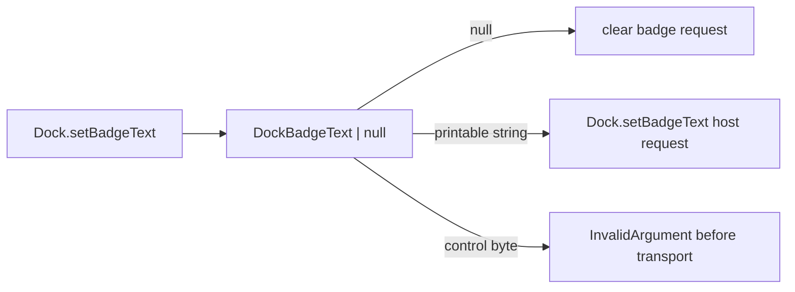

# Architecture: Validate Dock.setBadgeText display strings

## Domain

Dock badge text is platform-visible UI text. The contract must reject malformed display strings before transport while preserving `null` as the explicit clear operation.

## Evidence gathered

- `gh issue view 814` — issue defines the failing behavior, required valid cases, invalid NUL/newline cases, and out-of-scope areas.
- `packages/native/src/contracts/dock.ts` — `DockSetBadgeTextInput.text` is currently `Schema.NullOr(Schema.String)`.
- `packages/native/src/index.test.ts` — Dock bridge tests already assert request shape for `setBadgeText(null)` and service delegation for `"5"`.
- `ast-grep` — `Schema.NullOr(Schema.String)` appears only in `DockSetBadgeTextInput`.
- `engineering/SPEC.md` §11.20 / Appendix K — `Dock.setBadgeText(text: string | null)` is macOS-only; unsupported platforms model failure as typed values.
- `engineering/learnings/2026-05-08-validate-dialog-native-ui-text-fields.md` — schema changes inside exported `Schema.Class` declarations require API snapshot verification.

## Problem

`Dock.setBadgeText` treats arbitrary strings as badge display text, so control characters cross the SDK-to-host boundary.

## Game board

- Players: SDK callers, native host adapters, reviewers, CI, future primitive authors.
- Incentives: callers want a simple clear/display API; implementers are tempted to use raw strings; reviewers need the contract visible in schemas and snapshots.
- Information asymmetries: the host sees platform-specific rendering limits later than the SDK boundary; callers only see the public API.
- Bad equilibrium: each primitive invents ad hoc display-string validation or lets platform adapters normalize unsafe text.
- Desired equilibrium: display-text constraints live in the exported contract schema, invalid text fails as `InvalidArgument`, and request-shape tests prove no transport occurs.

## Constraints

- `null` remains the only clear operation.
- Valid short text such as `"1"` must keep the existing request shape.
- Control bytes, including NUL and newline, must fail before transport.
- No platform adapter behavior changes.
- No new public service or broad shared abstraction for a single Dock field.

## Core trade-off

I am trading acceptance of empty string as a legacy display value for a minimal compatibility-preserving boundary that only removes control characters.

## Architecture

Add a private `DockBadgeText` schema in `packages/native/src/contracts/dock.ts` and use it inside `DockSetBadgeTextInput` as `Schema.NullOr(DockBadgeText)`. The primitive is "badge display text", not "generic string"; the schema should reject ASCII control bytes without changing `null` or existing non-empty printable strings.

## Modules

- `packages/native/src/contracts/dock.ts`
  - Responsibility: define the runtime contract for Dock host inputs.
  - Interface: `DockSetBadgeTextInput.text: Schema.NullOr(DockBadgeText)`.
  - Hides: byte-level display-text validation policy.
  - Dependency category: pure-core schema.
  - State ownership: none.
  - Error model: bridge client maps schema decode failure to typed `InvalidArgument`.
  - Test strategy: bridge client regression confirms invalid values do not reach exchange.

- `packages/native/src/index.test.ts`
  - Responsibility: prove the SDK boundary behavior.
  - Interface: existing Dock bridge client tests plus one invalid-input test.
  - Hides: no implementation detail; records observable contract.
  - Dependency category: in-process test.
  - State ownership: captured requests array.
  - Error model: assert `InvalidArgument` and no request.
  - Test strategy: keep `null` and valid text shape, reject NUL/newline.

## Non-goals

- Badge count and progress validation.
- Jump-list item validation.
- Host adapter rendering or platform-specific normalization.
- A shared native display-text abstraction across primitives.
