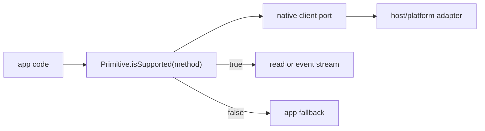

## Problem

App code cannot observe partial or unsupported OS-state capability before using several Appendix K non-✓ methods.

## Game board

- Players: app authors, native service maintainers, production checker, host adapters.
- Incentives: direct reads and subscriptions are locally cheaper than capability discovery.
- Information asymmetries: Linux session and desktop-environment support is known at adapter/runtime boundaries, while app code only sees public SDK methods.
- Bad equilibrium: apps learn support by first-use failure or by fallback values.
- Desired equilibrium: guard calls are the obvious, typed expression before every non-✓ OS-state operation.

## Constraints

- Existing `Screen`, `PowerMonitor`, and `SystemAppearance` operations must keep their current call shape.
- Guard calls must not require the guarded operation or event subscription.
- Guard method inputs must be typed literals so invalid method names fail at the SDK boundary.
- The change is SDK/contract-level; routing public host methods is out of scope for this issue.

## Grounding findings

- `engineering/SPEC.md` §11.0 and Appendix K require `<Primitive>.isSupported(method)` before partial or unsupported rows.
- `Dock.isSupported(method)` is the local reference shape: method literal schema, `{ supported: boolean }` result, permission `"none"`, bridge validation, and service-level boolean mapping.
- `PowerMonitor` currently has no request methods; the API contract can still add `isSupported` while preserving event streams.
- `SystemAppearance` currently returns fallback values from its unsupported client for read methods, so a separate guard is needed to expose unsupported state before reads.
- `engineering/learnings/2026-05-06-linux-polish-capability-probes.md` warns that support probes are source-of-truth code and must not leak one platform's environment facts globally.

## Core trade-off

I am trading a small public API widening for explicit capability discovery and production-checkable contracts.

## Architecture

Each affected primitive gets a primitive-local operation literal, an `IsSupportedInput` schema, and a `SupportedResult` schema. The API spec adds `isSupported` with permission `"none"`. The client port returns the result wrapper; the public service maps it to `boolean`, matching Dock's application-facing guard shape.

Unsupported clients return `supported: false` without touching the guarded operation. Existing bridge clients send `Primitive.isSupported` envelopes and validate the method name before transport. Mock clients used by tests return `true` so existing happy-path behavior stays explicit.

## Modules

- Contract schemas: own primitive-local method names, guard input, and support result. Hide raw strings and invalid guard targets. Test by API spec and invalid-input bridge tests.
- Native service modules: own API spec, client port, bridge mapping, unsupported-client answer, and service boolean mapping. Hide transport result wrappers from app code. Test by service delegation, bridge envelope capture, and unsupported-client false guards.
- Production checker config: already models `isSupportedGuard`; add regression coverage for OS-state non-✓ contracts so the checker recognizes the new guard expression contractually.

## Principle fit

- Single source of truth: method literals live with each primitive contract.
- Deep modules: the service absorbs wrapper decoding and exposes a narrow boolean guard.
- No silent fallback: support state is explicit; unsupported clients fail closed.
- Least privilege: guard methods require permission `"none"`.

## Non-goals

- Native host implementation of environment-specific support probes.
- Static control-flow analysis beyond the existing production-checker contract model.
- Changing Appendix K support rows.
